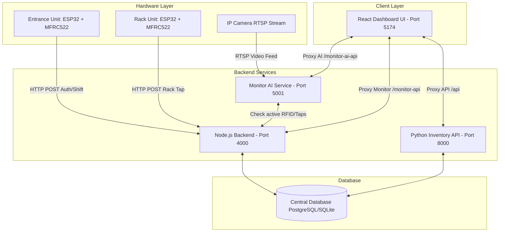

# Project Report: AI-Based Inventory Movement & Stock Monitoring System

## 1. Executive Summary

The **AI-Based Inventory Movement & Stock Monitoring System** (WisRight Smart Inventory) is a state-of-the-art warehouse and retail inventory management solution. By combining hardware tracking (RFID tags and scanners at entrances and racks) with edge computer vision (RT-DETR object detection and ByteTrack tracking), the system eliminates manual stock-counting errors, prevents inventory shrinkage, and provides real-time, independent verification of physical stock movements. 

Traditional inventory management relies on paper records or barcode scans, which are prone to human errors or deliberate omissions. The WisRight system addresses this by introducing a transparent verification tray: when a worker claims to move stock, a top-down AI camera counts the physical objects and cross-checks the count against manual RFID scans, only committing "Verified" entries to the central database.

---

## 2. System Architecture

The project is structured as a multi-tier microservice architecture consisting of four main services coordinating over local and cloud networks:



### 2.1 Component Overview

1. **Entrance Unit (Firmware/Hardware)**: An ESP32 microcontroller paired with an MFRC522 RFID reader. Placed at room doorways to log employee check-ins and check-outs.
2. **Rack Unit (Firmware/Hardware)**: An ESP32 + MFRC522 RFID setup positioned at individual inventory racks. Logs specific item selections and pairs them with checking-in employees.
3. **Node.js Backend (Server)**: Manages authentication, RFID session validation, door entry logs, alerts, and user profiles. Exposed on port `4000`.
4. **Python Inventory API**: Built using FastAPI, it manages product catalogs, stock levels, historical movement logs, and analytics. Exposed on port `8000`.
5. **Monitor AI Service**: Runs PyTorch, RT-DETR (Real-Time DEtection TRansformer), and ByteTrack. Captures the RTSP camera feed of the verification tray or doorway, performs object detection, tracks workers, and updates the Node backend with confidence scores. Exposed on port `5001`.
6. **Dashboard Frontend**: A React + Vite web dashboard styled with CSS and Tailwind CSS, presenting tailored interfaces for Employees, Admins, and Shop Owners.

---

## 3. Database Schema

The database utilizes a unified design schema to track shifts, stock count, AI detections, and security alerts. Below are the key tables defined in [db.js](file:///c:/Users/VISHALI/smart-inventary-1/server/db.js):

### 3.1 `admins`
Stores user credentials for administrators.
- `id` (SERIAL PRIMARY KEY)
- `username` (TEXT UNIQUE)
- `password_hash` (TEXT)

### 3.2 `employees`
Stores register details of warehouse personnel.
- `id` (SERIAL PRIMARY KEY)
- `emp_id` (TEXT UNIQUE)
- `name` (TEXT)
- `rfid_tag` (TEXT UNIQUE)
- `department` (TEXT)
- `shift` (TEXT)
- `password_hash` (TEXT)

### 3.3 `products`
The canonical catalog tracking product metadata and current quantities.
- `id` (SERIAL PRIMARY KEY)
- `product_id` (TEXT UNIQUE)
- `name` (TEXT)
- `room` (TEXT)
- `rack` (TEXT)
- `unit` (TEXT)
- `qty` (INTEGER)
- `expiry_date` (TEXT)

### 3.4 `movements`
Auditable log of all stock movements.
- `id` (SERIAL PRIMARY KEY)
- `date` (TEXT)
- `emp_id` (TEXT)
- `employee_name` (TEXT)
- `room` (TEXT)
- `rack` (TEXT)
- `product_id` (TEXT)
- `product_name` (TEXT)
- `action` (TEXT) - e.g., 'IN', 'OUT'
- `quantity` (INTEGER) - quantity scanned or logged
- `source` (TEXT) - 'auto' or 'manual'
- `entry_time` / `exit_time` / `duration` (TEXT)
- `status` (TEXT) - verification status (e.g., 'VERIFIED')
- `notes` (TEXT)

### 3.5 `room_entries`
Tracks worker shifts based on door RFID taps.
- `id` (SERIAL PRIMARY KEY)
- `date` (TEXT)
- `emp_id` (TEXT)
- `employee_name` (TEXT)
- `rfid_tag` (TEXT)
- `room` (TEXT)
- `entry_time` (TEXT)
- `exit_time` (TEXT)
- `duration` (TEXT)
- `status` (TEXT) - 'Active' or 'Completed'

### 3.6 `detections` & `alerts`
Tracks real-time computer vision data and unauthorized entries.
- **`detections`**: `id`, `tracking_id`, `emp_id`, `confidence`, `room`, `time`
- **`alerts`**: `id`, `type`, `person`, `room`, `time`, `status` ('open', 'resolved')

---

## 4. End-to-End Workflows

### 4.1 Step 1: Room Check-in / Login
An employee arrives at the stock room and taps their RFID card at the entry reader. 
- The [EntranceUnit](file:///c:/Users/VISHALI/smart-inventary-1/firmware/EntranceUnit/EntranceUnit.ino) captures the RFID card UID and sends a POST request to `/api/rfid/entry-scan`.
- If no active session exists, a new session is opened in `room_entries` (Status: `Active`).
- If an active session already exists, it is marked as `Completed`, capturing the exit timestamp and calculating the duration.

### 4.2 Step 2: Product Pick & Rack Scan
The employee goes to a rack (e.g., Rack A) to pick up a quantity of a product (e.g., HB Pencils).
- The employee scans the product's RFID tag at the [RackUnit](file:///c:/Users/VISHALI/smart-inventary-1/firmware/RackUnit/RackUnit.ino) reader.
- The Node backend verifies that the employee has an active room session. If not, it returns `403 Forbidden` (Rack accountability rule: all activity must tie to an open shift).

### 4.3 Step 3: AI Tray Verification
Before the picked product leaves the room, the employee places the items inside a transparent, illuminated verification tray.
- A top-down camera captures high-definition frames of the tray and feeds them to the **Monitor AI Service**.
- The service runs object detection using the `RT-DETR` model. It detects individual items and returns their counts and classification labels.
- The system compares the detected items and counts against the employee's scanned values.
- **Verification Outcomes**:
  - `VERIFIED`: Exact match between manually scanned items and AI-detected count. The transaction is saved.
  - `WRONG_PRODUCT`: Detected items do not match the expected category.
  - `MISSING_PRODUCT`: Quantity detected is less than the manual scan.
  - `EXTRA_PRODUCT`: Quantity detected is greater than the manual scan.
  - `UNEXPECTED_PRODUCT` / `MIXED_PRODUCTS`: Mismatched categories and counts. The backend blocks auto-storage and generates a pending alert.

---

## 5. Firmware Details

The hardware firmware is written in C++ for ESP32 boards using the `MFRC522` library. Both devices support:
- **Dynamic Pin Configurations**: To ease field deployment, the boards automatically cycle through SPI pin headers (standard vs. custom development boards) to locate the MFRC522 RFID chip.
- **Secure Networking**: Using `WiFiClientSecure` to communicate with the HTTPS endpoints on `inventory.wisright.com` via Nginx reverse-proxies.
- **NTP Clock Synchronization**: The Entrance Unit connects to NTP pools to sync the local clock to Indian Standard Time (IST, UTC+5:30) for localized offline logging when database connections are unstable.

---

## 6. AI and Computer Vision Pipeline

```
[Camera Stream] -> [RT-DETR Model] -> [ByteTrack Tracker] -> [Verification Engine] -> [Audit DB]
```

1. **Object Detection (RT-DETR)**: The system utilizes `rtdetr_r50vd` (Real-Time DEtection TRansformer), which offers high accuracy with latency far superior to traditional YOLO architectures.
2. **Pretrained Vocabulary vs. Custom Catalog**:
   - The default model maps to COCO vocabulary (e.g., *bottle, scissors, keyboard, book*).
   - Unlabeled catalog products (e.g., *Staplers, HB Pencils, Highlighters*) show up as `Unknown` tags.
   - A fine-tuning pipeline is built in the `inventory_ai/backend/training/` directory to allow retraining on custom images taken directly within the transparent verification box.
3. **Tracking (ByteTrack)**: Maintains object identities across frames to avoid double-counting or misses due to temporary occlusion (e.g., worker's hands moving over the tray).

---

## 7. Role-Based Capabilities Matrix

| System Action | Employee (Floor Operator) | Admin (Control Room) | Shop Owner (Business) |
| :--- | :---: | :---: | :---: |
| Find Product Locations (Search) | ✓ | ✓ | ✓ |
| Clock-in/out (RFID Entrance Taps) | ✓ | ✓ | — |
| View Active Employees ("Who's in") | — | ✓ | ✓ |
| Track Movement History (Auditing) | — | ✓ | ✓ |
| Real-time Alerts (Mismatches & Intrusion) | — | ✓ | ✓ |
| Generate and Download Product QR Codes | — | ✓ | ✓ |
| Scan QR Code for Details | ✓ | ✓ | ✓ |

---

## 8. Development & Installation Guide

To run the full stack locally for development or testing:

1. **Start Server (Node Backend)**
   ```bash
   cd server
   npm install
   # Create server/.env with JWT_SECRET=your_secret
   npm start
   ```
2. **Start Inventory API (Python FastAPI)**
   ```bash
   cd inventory_ai
   # Activate virtualenv (e.g., .\.venv\Scripts\activate)
   pip install -r requirements.txt
   python -m database.seed
   python -m uvicorn backend.main:app --host 127.0.0.1 --port 8000
   ```
3. **Start Monitor AI Service (IP Camera / Webcam)**
   ```bash
   cd inventory_ai
   # Make sure MONITOR_CAMERA_URL is set in backend/monitor_service/.env
   python -m backend.monitor_service.main
   ```
4. **Start Web Dashboard (React + Vite)**
   ```bash
   cd inventory_ai/dashboard
   npm install
   npm run dev
   ```
   *Dashboard Access:* [http://localhost:5174](http://localhost:5174) (Admin credentials: `admin` / `admin123`)

---

## 9. Conclusion

The WisRight AI-Based Inventory & Stock Monitoring System demonstrates a highly integrated approach to modern logistics. By enforcing physical accountability at the point of action—verifying RFID entries with neural-network-driven visual confirmations—the system mitigates human logging errors and establishes a high-fidelity audit trail. 
Future expansions can build upon the existing base to incorporate automated restocking procurement workflows and extend detection to multi-camera arrangements across wider open shelving areas.
